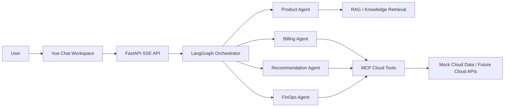

# CloudCare Agent

**CloudCare Agent is an open-source multi-agent platform for cloud customer support and FinOps automation.**

It combines FastAPI, Vue, LangGraph, MCP tools, RAG, knowledge-oriented retrieval, and structured mock cloud billing data to demonstrate how modern customer service can move beyond FAQ chatbots into accountable, tool-using, business-aware AI workflows.

CloudCare Agent is built around a simple belief:

> The next generation of customer support will not just answer questions. It will understand business context, call trusted tools, explain its reasoning, quantify impact, and hand off safely when risk is high.

## Why This Project Exists

Most AI customer service demos stop at fluent conversation. Real support teams need more.

They need systems that can:

- answer product questions with grounded knowledge;
- query user-specific orders, resources, and usage data;
- diagnose waste, risk, and operational inefficiency;
- estimate business impact instead of giving vague advice;
- preserve a path toward traceability, evaluation, and human approval.

CloudCare Agent focuses on a high-value vertical: **cloud service support and FinOps cost optimization**. This is where intelligent customer service has direct commercial value: lower support cost, faster issue resolution, better cloud spend governance, higher customer trust, and stronger upsell or renewal opportunities.

## What It Does

CloudCare Agent currently supports a realistic cloud-support workflow:

1. A user asks about cloud products, orders, resources, billing, or cost optimization.
2. An orchestrator routes the request to a specialized agent.
3. Agents call MCP tools instead of inventing business facts.
4. Mock cloud data provides orders, instances, metrics, monthly bills, resource costs, and pricing assumptions.
5. The FinOps flow generates structured optimization output, including idle-resource diagnosis, estimated monthly savings, risk notes, and source metadata.

The project is intentionally designed for extension: mock tools can later be replaced with real cloud provider APIs, CRM systems, ticketing systems, observability platforms, or internal billing systems.

## Core Capabilities

- **Multi-agent orchestration**: routes requests across Product, Billing, Promotion, Recommendation, and FinOps agents.
- **Tool-first reasoning**: uses MCP tools for cloud orders, resources, monitoring, billing summaries, savings estimates, and structured FinOps reports.
- **Grounded support knowledge**: includes RAG and knowledge-graph oriented modules for cloud product and support documents.
- **Structured FinOps output**: produces machine-readable optimization reports rather than relying only on free-form model text.
- **Mock-first open-source demo**: runs useful workflows without requiring MySQL, Redis, Milvus, or real cloud credentials.
- **Streaming API**: FastAPI backend streams assistant responses through SSE.
- **Modern web workspace**: Vue 3 + Element Plus frontend provides a chat-first customer support interface.
- **Research-backed roadmap**: includes market research, product direction analysis, technical planning, and implementation backlog.

## Technical Architecture



## Why It Is Technically Interesting

### 1. Agentic workflow, not a chatbot wrapper

CloudCare Agent separates intent routing, product support, billing lookup, recommendation, promotion, and FinOps analysis into specialized agents. This makes the system easier to reason about, test, extend, and govern.

### 2. MCP-native business integration

The project uses Model Context Protocol style tools as the integration boundary between language models and business systems. This creates a clean path from mock data to real enterprise systems while keeping permissions, observability, and tool contracts explicit.

### 3. Structured business outputs

The FinOps flow can generate a structured `finops_report` with:

- billing summary;
- resource diagnostics;
- CPU, memory, and bandwidth evidence;
- cost optimization recommendations;
- estimated monthly savings;
- approval requirements;
- source metadata.

This matters because business software needs data objects, not only prose.

### 4. Open-source friendly mock mode

Many enterprise AI demos require private databases and credentials. CloudCare Agent defaults to `MOCK_DATA_MODE=true`, allowing contributors to run tests and explore the FinOps flow locally.

### 5. Designed for evaluation and AgentOps

The roadmap explicitly includes trace replay, tool-call inspection, golden set evaluation, answer-source coverage, and support-quality metrics. These are essential for moving from impressive demos to reliable systems.

## Commercial Value

CloudCare Agent targets a painful and measurable business problem: cloud support cost and cloud spend waste.

Potential business applications include:

- **Cloud service customer support**: reduce repetitive support workload with grounded, tool-using AI.
- **FinOps assistant**: detect idle or oversized resources and estimate savings opportunities.
- **SaaS operations support**: help internal teams diagnose infrastructure cost and usage issues.
- **MSP and cloud reseller tooling**: provide customers with automated support, recommendations, and optimization reports.
- **AI support platform prototype**: serve as a foundation for enterprise pilots involving agentic support workflows.

The value proposition is concrete:

- faster first response;
- fewer repeated support tickets;
- more transparent resource and billing explanations;
- measurable cost optimization opportunities;
- safer automation through human approval boundaries;
- stronger customer trust through traceable tool-based answers.

## Repository Structure

```text
agent/                 Multi-agent system, MCP tools, memory, RAG helpers
app/                   FastAPI backend and chat streaming API
front/cloud_agent/     Vue 3 frontend workspace
mock_data/             Cloud product and support knowledge documents
docs/research/         Market research, direction analysis, and technical roadmap
scripts/               Local development startup scripts
```

## Quick Start

### 1. Prepare environment

```bash
cp agent/.env.example agent/.env
```

For local demos, keep mock mode enabled:

```bash
MOCK_DATA_MODE=true
```

Set `DASHSCOPE_API_KEY` when you want to run real LLM calls.

### 2. Install Python dependencies

```bash
uv venv .venv --python 3.12
uv pip install -r agent/requirements.txt fastapi uvicorn langchain-openai langchain-milvus langchain-neo4j python-multipart
```

### 3. Install frontend dependencies

```bash
cd front/cloud_agent
npm install
cd ../..
```

### 4. Run locally

Start backend:

```bash
./scripts/dev_backend.sh
```

Start frontend:

```bash
./scripts/dev_frontend.sh
```

Or start both:

```bash
./scripts/dev_all.sh
```

Default URLs:

- Frontend: http://127.0.0.1:5174
- Backend docs: http://127.0.0.1:5001/docs

## FinOps Demo

The MCP cloud platform server supports local mock FinOps tools:

- `query_user_orders`
- `query_user_instances`
- `query_monthly_bill_summary`
- `query_resource_cost_breakdown`
- `query_instance_metrics`
- `analyze_instance_usage`
- `estimate_savings`
- `generate_finops_report`

Example:

```bash
cd agent
MOCK_DATA_MODE=true ../.venv/bin/python - <<'PY'
from mcp_servers.cloud_platform_server import generate_finops_report
print(generate_finops_report("user_1001", "2026-05")[:800])
PY
```

## Tests

```bash
MOCK_DATA_MODE=true ./.venv/bin/python -m pytest \
  agent/test/test_finops_mock_provider.py \
  agent/test/test_finops_mcp_tools.py \
  -v
```

## Documentation

- [Master document](docs/research/2026-06-03-cloudcare-agent-master-doc.md)
- [Market research report](docs/research/2026-06-02-intelligent-customer-service-agent-market-research.md)
- [Project opportunity directions](docs/research/2026-06-02-project-opportunity-directions.md)
- [Evaluation and roadmap](docs/research/2026-06-02-direction-evaluation-and-roadmap.md)
- [Technical plan and backlog](docs/research/2026-06-03-finops-technical-plan-and-backlog.md)

## Roadmap

- Render structured FinOps reports in the frontend.
- Add trace replay for routing decisions and tool calls.
- Build an AgentOps layer for evaluation, feedback, and regression testing.
- Add golden set evaluation for support and FinOps scenarios.
- Connect real cloud provider billing and resource APIs.
- Add knowledge-base gap discovery for support operations.

## Security and Governance

- Never commit `agent/.env`.
- Use `agent/.env.example` for configuration templates.
- Mock mode is enabled by default for open-source demos.
- Treat all savings as estimates unless backed by real billing APIs.
- Require human approval before any real cloud resource change.

## Project Status

CloudCare Agent is an early-stage open-source project. The current focus is building a convincing, extensible MVP for agentic cloud support and FinOps workflows.

Contributions are welcome around:

- cloud provider integrations;
- frontend FinOps report rendering;
- trace and evaluation infrastructure;
- knowledge-base quality workflows;
- safer tool execution and approval patterns.

