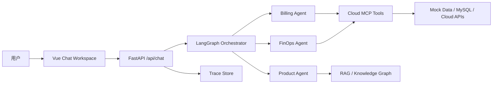

# CloudCare Agent 总文档

日期：2026-06-03

## 1. 项目愿景

CloudCare Agent 是一个面向云服务、SaaS 运维团队和云代理商的智能客服与 FinOps 成本优化助手。它不是普通 FAQ 聊天机器人，而是通过多智能体编排和工具调用完成产品咨询、账单查询、资源诊断、降本建议、推广推荐和运行链路追踪。

推荐定位：

> 云服务智能客服与成本优化助手。

英文名：

> CloudCare Agent

## 2. 行业调研摘要

完整报告见：

- [智能客服智能体市场调研报告](./2026-06-02-intelligent-customer-service-agent-market-research.md)
- [基于 Cloud Agent 项目的业务落地方向梳理](./2026-06-02-project-opportunity-directions.md)
- [项目方向评估矩阵与落地路线](./2026-06-02-direction-evaluation-and-roadmap.md)

核心判断：

1. 智能客服正在从 FAQ 机器人走向可调用工具、可执行业务流程、可审计的 agent。
2. 企业真正关心的是自动解决率、平均处理时长、人工节省、风险控制和 ROI。
3. 泛客服竞争激烈，不适合作为个人开源项目主线。
4. 云服务 / SaaS / IT 支持 / FinOps 是更适合本项目的垂直场景。
5. 当前项目已有 BillingAgent、FinOpsAgent、ProductAgent、RecommendationAgent、MCP 工具和 RAG 基础，适合继续做成“云服务智能客服 + 成本优化助手”。

## 3. 当前项目基础

已有能力：

- Vue + Element Plus 聊天前端。
- FastAPI + SSE 流式后端。
- LangGraph 多智能体编排。
- Product / Billing / Promotion / Recommendation / FinOps 多个业务 agent。
- MCP server 工具层。
- Redis/Milvus 记忆与语义缓存雏形。
- ECS、RDS、退款、安全、工单等 mock 知识文档。

主要短板：

- 工具层依赖 MySQL，占位配置下 demo 不稳定。
- 缺少本地 Mock 模式。
- FinOps 工具只有粗粒度监控聚合，缺少账单聚合、费用拆解和节省金额估算。
- Agent 输出多为自然语言，前端暂时不能稳定展示结构化报告。
- 缺少 Trace、评估和运行回放能力。

## 4. 技术方案摘要

完整技术方案见：

- [云服务 FinOps 智能客服技术方案与工作量评估](./2026-06-03-finops-technical-plan-and-backlog.md)

推荐架构：

五层改造：

1. 数据与工具层：补齐订单、实例、监控、费用、节省估算工具。
2. 智能体编排层：让 Billing -> FinOps 传递结构化业务上下文。
3. API 与 SSE 层：支持文本流、业务 payload、trace event。
4. 前端工作台层：展示资源表、建议卡片、报告和运行链路。
5. 评估与观测层：记录路由、工具调用、错误、答案来源和用户反馈。

## 5. 已确定的阶段路线

### P0：开源和本地 demo 基线

目标：

- 仓库适合开源。
- 默认不泄露密钥。
- 没有 MySQL/Redis/Milvus 时也能跑基础 demo。

待办：

- [x] 增加根目录 `.gitignore`。
- [x] 增加 `agent/.env.example`。
- [ ] 增加 Mock 数据模式。
- [ ] 增加启动脚本。
- [ ] 更新 README。

### P1：FinOps 业务工具增强

目标：

- 支持账单摘要、资源费用拆解、监控明细、节省金额估算。

待办：

- [ ] 新增 Mock 数据提供器。
- [ ] 新增 `query_monthly_bill_summary` 工具。
- [ ] 新增 `query_resource_cost_breakdown` 工具。
- [ ] 新增 `query_instance_metrics` 工具。
- [ ] 新增 `estimate_savings` 工具。
- [ ] 修复重复 `get_promotion_materials` 定义。
- [ ] 为工具增加单元测试。

### P2：结构化 FinOps 报告

目标：

- FinOpsAgent 不只输出自然语言，还能输出结构化报告。

待办：

- [ ] 定义 `finops_report` schema。
- [ ] BillingAgent 沉淀结构化资源和账单上下文。
- [ ] FinOpsAgent 消费结构化上下文。
- [ ] SSE 输出 `business_payload`。
- [ ] 前端解析并展示业务 payload。

### P3：前端业务工作台

目标：

- 从纯聊天界面升级为云资源诊断工作台。

待办：

- [ ] 拆分 `App.vue`。
- [ ] 新增资源表格组件。
- [ ] 新增建议卡片组件。
- [ ] 新增报告视图组件。
- [ ] 新增 Trace 抽屉。
- [ ] 新增用户反馈按钮。

### P4：Trace 与评估

目标：

- 支持回放智能体运行链路，为后续 AgentOps 做基础。

待办：

- [ ] 每次请求生成 `trace_id`。
- [ ] 记录 Orchestrator 路由。
- [ ] 记录 agent start/end。
- [ ] 记录 tool call/result。
- [ ] 提供 trace 查询 API。
- [ ] 准备 10 条 demo/golden set 问题。

## 6. 工作量评估

| 范围 | 工作量 |
| --- | ---: |
| 最小可演示 MVP | 10-14 人日 |
| 带 Trace 和基础评估的完整 MVP | 18-27 人日 |
| 接真实云厂商 API | 额外 5-15 人日 |

当前建议先完成 P0 + P1。这样项目会立刻更适合开源，也能支撑后续 FinOps 报告和前端展示。

## 7. 开源包装建议

README 应突出：

- 这是一个“云服务智能客服 + FinOps agent”项目，而不是通用 chatbot。
- 支持多智能体编排、MCP 工具、RAG、Mock 云资源数据和成本优化建议。
- 默认 Mock 模式可快速体验。
- 真实 DashScope / MySQL / Redis / Milvus 配置可选。

推荐目录说明：

- `agent/`：多智能体、MCP、RAG、记忆。
- `app/`：FastAPI API 层。
- `front/cloud_agent/`：Vue 前端工作台。
- `mock_data/`：知识库文档。
- `docs/research/`：市场调研、技术方案、路线图。

## 8. 下一步执行计划

本轮先执行：

1. 新增总文档。
2. 新增实现计划。
3. 新增 Mock 数据提供器。
4. 增强 MCP FinOps 工具。
5. 更新 FinOpsAgent 工具使用提示。
6. 增加工具单测。

