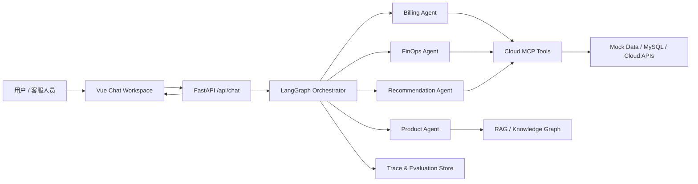

# 云服务 FinOps 智能客服技术方案与工作量评估

日期：2026-06-03

## 1. 目标与范围

本文基于现有 Cloud Agent 项目，梳理将项目升级为“云服务智能客服 + FinOps 成本优化助手”的技术改造思路、工作量评估和代办项。

目标不是一次性做成完整商业客服平台，而是先做一个可演示、可扩展、可讲清业务价值的 MVP：

> 用户可以通过聊天发起云产品咨询、账单查询、资源诊断和降本优化请求；系统通过多智能体和工具调用完成查询、分析、建议生成，并在前端以结构化方式展示结果和运行链路。

第一阶段暂不做：

- 真实云资源变更执行。
- 多租户商业后台。
- 语音客服。
- 复杂 CRM/ITSM 集成。
- 完整权限体系和企业级审计。

## 2. 当前项目基础评估

### 2.1 已有能力

后端：

- `app/app_main.py` 提供 FastAPI 服务。
- `app/router/chat.py` 提供 `/api/chat` SSE 流式接口。
- `app/service/chat_service.py` 初始化 AgentGraph、Memory、SemanticCache，并流式返回模型结果。
- `agent/core/workflow/graph_manager.py` 使用 LangGraph 编排 Orchestrator、Product、Billing、Promotion、Recommendation、FinOps。
- `agent/core/workflow/state.py` 已定义全局 `AgentState`。

智能体：

- `agent/agents/orchestrator.py` 负责意图路由。
- `agent/agents/product_agent.py` 负责产品知识问答。
- `agent/agents/billing_agent.py` 负责订单和资源查询。
- `agent/agents/finops_agent.py` 负责资源使用率分析和降本建议。
- `agent/agents/recommendation_agent.py` 负责产品选型推荐。
- `agent/agents/promotion_agent.py` 负责推广物料和营销活动。

工具与数据：

- `agent/mcp_servers/cloud_platform_server.py` 已有订单、实例、监控、推广相关 MCP 工具。
- `agent/database/init_mock_data.sql` 已有订单、实例、监控指标 mock 表。
- `mock_data/` 已有 ECS、RDS、退款、安全、工单等知识文档。

前端：

- `front/cloud_agent/src/App.vue` 已有聊天主界面、场景入口、SSE 接收和 Markdown 渲染。

### 2.2 主要短板

1. 数据层还偏 demo：账单、资源、监控数据不够完整，缺少月度费用、产品线聚合、优化建议依据、预估节省金额。
2. Agent 输出偏自然语言：前端无法稳定识别“资源表格、建议卡片、报告、风险提示”。
3. 缺少 Trace：无法回放路由决策、工具调用、耗时、失败原因、答案来源。
4. 缺少评估闭环：没有固定 demo 问题、golden set、自动化测试和效果指标。
5. 前端仍是普通聊天界面：缺少 FinOps 场景需要的结构化展示。
6. 启动和环境配置偏手工：依赖、Python、Vite、端口、外部服务占位配置都需要整理。

## 3. 推荐总体架构

建议采用“五层结构”改造，保持当前项目主体不推倒重来。



### 3.1 数据与工具层

职责：

- 提供订单、实例、账单、监控、优惠活动、成本建议规则等结构化数据。
- 所有业务数据查询通过工具完成，避免模型编造。

建议改造：

- 扩展 `agent/database/init_mock_data.sql`。
- 扩展 `agent/mcp_servers/cloud_platform_server.py`。
- 新增本地 JSON mock 数据或 SQLite 兜底模式，降低 MySQL 依赖。

### 3.2 智能体编排层

职责：

- Orchestrator 判断用户意图。
- BillingAgent 查询费用与资源事实。
- FinOpsAgent 基于事实生成优化建议。
- Product/Recommendation/Promotion 保持售前和知识咨询能力。

建议改造：

- 扩展 `AgentState.metadata`，传递 `trace_id`、结构化业务上下文和工具结果摘要。
- Billing -> FinOps 的 handoff 不只依赖自然语言消息，而要传结构化 resource/billing payload。
- FinOpsAgent 输出统一 schema，包括 `summary`、`resources`、`recommendations`、`risks`、`estimated_savings`。

### 3.3 运行观测层

职责：

- 记录每次对话的路由、工具调用、耗时、错误、答案来源、缓存命中。
- 为后续 AgentOps 和评估面板打基础。

建议新增：

- `app/infra/trace_store.py`
- `app/service/trace_service.py`
- `app/router/traces.py`
- 本地 JSONL 或 SQLite 存储，MVP 阶段不必上复杂数据库。

### 3.4 API 与流式协议层

职责：

- 保留现有 SSE 文本流。
- 增加事件类型，支持前端接收结构化消息。

建议 SSE 事件：

- `message_delta`：普通文本增量。
- `trace_event`：路由、工具调用、工具结果摘要。
- `business_payload`：资源表、账单摘要、建议卡片、报告结构。
- `done`：完成。
- `error`：友好错误。

### 3.5 前端工作台层

职责：

- 不只展示 Markdown 聊天，而是展示“云资源诊断工作台”。

建议改造：

- 保留聊天主线。
- 增加资源表格组件。
- 增加成本优化建议卡片。
- 增加报告视图。
- 增加 Trace 侧栏。
- 增加反馈按钮。

## 4. 核心数据模型建议

### 4.1 FinOps 业务输出

```json
{
  "type": "finops_report",
  "summary": {
    "title": "近 7 天资源成本优化建议",
    "overall_status": "has_savings_opportunity",
    "estimated_monthly_savings": 820.5,
    "currency": "CNY"
  },
  "resources": [
    {
      "instance_id": "i-bp1_user1001_ecs",
      "instance_type": "ecs.g8a.4xlarge",
      "status": "Running",
      "region_id": "cn-beijing",
      "cpu_avg_7d": 2.41,
      "memory_avg_7d": 18.83,
      "network_peak_mbps": 2.0,
      "diagnosis": "RESOURCES_IDLE"
    }
  ],
  "recommendations": [
    {
      "resource_id": "i-bp1_user1001_ecs",
      "action": "downsize",
      "priority": "high",
      "title": "建议将 ecs.g8a.4xlarge 降配到更小规格",
      "reason": "近 7 天 CPU 与内存长期低利用率",
      "risk": "降配前需确认业务峰值和定时任务",
      "estimated_monthly_savings": 820.5,
      "requires_approval": true
    }
  ],
  "sources": [
    {
      "type": "tool",
      "name": "analyze_instance_usage",
      "trace_id": "trace_20260603_001"
    }
  ]
}
```

### 4.2 Trace 事件

```json
{
  "trace_id": "trace_20260603_001",
  "session_id": "session_default_1",
  "user_id": "user_1001",
  "event_type": "tool_call",
  "agent": "finops_agent",
  "tool_name": "analyze_instance_usage",
  "arguments": {
    "instance_id": "i-bp1_user1001_ecs",
    "user_id": "[injected]"
  },
  "status": "success",
  "latency_ms": 320,
  "created_at": "2026-06-03T10:00:00+08:00"
}
```

## 5. 模块级改造项

### 5.1 后端 API

涉及文件：

- `app/router/chat.py`
- `app/service/chat_service.py`
- `app/schemas/chat.py`

改造点：

- `ChatRequest` 增加 `debug`、`return_trace` 可选字段。
- `stream_chat` 生成 `trace_id`。
- SSE 从单一 `content` 字段升级为事件化 payload。
- 错误统一转换为用户友好信息，同时写入 trace。

预估工作量：1.5-2 人日。

### 5.2 AgentState 与编排

涉及文件：

- `agent/core/workflow/state.py`
- `agent/core/workflow/graph_manager.py`
- `agent/agents/orchestrator.py`
- `agent/agents/billing_agent.py`
- `agent/agents/finops_agent.py`

改造点：

- `AgentState.metadata` 规范化，加入 `trace_id`、`business_context`、`tool_results`。
- Orchestrator 路由结果写 trace。
- BillingAgent 工具结果沉淀为结构化资源/账单上下文。
- FinOpsAgent 优先读取结构化上下文，而不是只读聊天历史。
- FinOpsAgent 输出结构化 report，同时生成 Markdown 摘要。

预估工作量：3-5 人日。

### 5.3 MCP 工具与 Mock 数据

涉及文件：

- `agent/mcp_servers/cloud_platform_server.py`
- `agent/database/init_mock_data.sql`
- 可新增 `agent/mcp_servers/mock_data_provider.py`

改造点：

- 新增 `query_monthly_bill_summary`：按月、产品、资源聚合费用。
- 新增 `query_resource_cost_breakdown`：单资源费用构成。
- 新增 `query_instance_metrics`：返回每日监控明细，而不只是聚合。
- 新增 `estimate_savings`：基于当前规格、建议规格和计费模式估算节省金额。
- 修复 `cloud_platform_server.py` 中重复定义的 `get_promotion_materials`，避免后定义覆盖前定义造成工具语义混乱。
- 增加本地 mock fallback，避免没有 MySQL 时核心 demo 直接不可用。

预估工作量：3-4 人日。

### 5.4 Trace / AgentOps 基础层

涉及文件：

- 新增 `app/infra/trace_store.py`
- 新增 `app/service/trace_service.py`
- 新增 `app/router/traces.py`
- 修改 `app/app_main.py` 注册路由
- 修改各 agent 或工具调用包装逻辑写入 trace

改造点：

- JSONL/SQLite 记录 trace。
- 提供 `GET /api/traces/{trace_id}`。
- 提供 `GET /api/sessions/{session_id}/traces`。
- 记录 router decision、agent start/end、tool call/result、error、business payload。

预估工作量：3-4 人日。

### 5.5 前端结构化展示

涉及文件：

- `front/cloud_agent/src/App.vue`
- 建议新增：
  - `front/cloud_agent/src/types/chat.ts`
  - `front/cloud_agent/src/components/FinOpsReport.vue`
  - `front/cloud_agent/src/components/ResourceTable.vue`
  - `front/cloud_agent/src/components/RecommendationCards.vue`
  - `front/cloud_agent/src/components/TraceDrawer.vue`

改造点：

- 拆分单文件 `App.vue`，降低维护压力。
- 解析 SSE 事件类型。
- 如果收到 `finops_report`，展示资源表和建议卡片。
- 增加 Trace 抽屉，展示路由和工具调用。
- 增加用户反馈按钮。

预估工作量：4-6 人日。

### 5.6 测试与评估

涉及文件：

- 新增 `agent/test/test_finops_tools.py`
- 新增 `agent/test/test_finops_agent.py`
- 新增 `app/test/test_chat_stream.py`
- 新增 `docs/research/demo_questions.md`

改造点：

- 工具函数单测：权限隔离、空数据、异常、节省金额估算。
- Agent 流程测试：FinOps 意图能触发 Billing -> FinOps。
- SSE 协议测试：能输出文本、trace、business payload。
- Demo 问题集：至少 10 条固定问题。

预估工作量：2-3 人日。

### 5.7 工程化与启动

涉及文件：

- 新增 `scripts/dev_backend.sh`
- 新增 `scripts/dev_frontend.sh`
- 新增 `scripts/dev_all.sh`
- 新增 `.env.example`
- 更新 `README.md` 或新增 `docs/development.md`

改造点：

- 固定后端端口 `5001`。
- 前端使用 `VITE_API_BASE_URL`。
- 文档说明 Python、uv、npm、MySQL/Mock 模式。
- 没有外部 Redis/Milvus/MySQL 时能跑最小 demo。

预估工作量：1-2 人日。

## 6. 工作量总体评估

按一个熟悉 Python/FastAPI/Vue/LangChain 的开发者估算：

| 阶段 | 范围 | 工作量 |
| --- | --- | ---: |
| P0 技术梳理与环境整理 | 启动脚本、配置、依赖、mock fallback | 2-3 人日 |
| P1 FinOps 业务闭环 | 工具、数据、Billing/FinOps handoff、结构化报告 | 6-9 人日 |
| P2 前端业务展示 | 资源表、建议卡片、报告视图、SSE 事件化 | 4-6 人日 |
| P3 Trace 基础层 | trace store、trace API、运行事件记录 | 3-4 人日 |
| P4 测试与 demo 集 | 单测、流程测试、固定问题集、验收脚本 | 2-3 人日 |
| P5 文档与包装 | README、演示脚本、项目介绍、截图素材 | 1-2 人日 |

合计：

- 最小可演示 MVP：约 10-14 人日。
- 带 Trace 和基础评估的完整 MVP：约 18-27 人日。
- 如果接真实云厂商 API：额外增加 5-15 人日，取决于 API 权限、鉴权、字段映射和数据质量。

## 7. 分阶段待办清单

### P0：环境与项目基线

- [ ] 增加 `.env.example`，列出 DashScope、MySQL、Redis、Milvus、Mock 模式配置。
- [ ] 增加一键启动脚本，分别启动 FastAPI 和 Vite。
- [ ] 固化后端默认端口为 `5001`，前端读取 `VITE_API_BASE_URL`。
- [ ] 增加 Mock 模式开关，没有 MySQL 时从本地数据返回订单/实例/监控。
- [ ] 修复 `mcp_servers.json` 中 `python` 命令对虚拟环境的依赖说明。

### P1：FinOps 数据与工具

- [ ] 扩展订单表，增加月份、资源 ID、产品类型、计费周期。
- [ ] 增加月度账单聚合 mock 数据。
- [ ] 增加每日资源监控明细查询工具。
- [ ] 增加资源费用拆解工具。
- [ ] 增加节省金额估算工具。
- [ ] 增加风险规则：Running 实例、低利用率、无公网流量、停止状态、RDS 不建议直接关停。
- [ ] 为所有工具返回统一 JSON schema：`status`、`data`、`message`、`source`。

### P2：Agent 编排与结构化输出

- [ ] Orchestrator 明确识别 FinOps、账单、选型、推广、产品咨询。
- [ ] BillingAgent 把工具结果写入 `metadata.business_context.billing`。
- [ ] BillingAgent 把实例列表写入 `metadata.business_context.resources`。
- [ ] FinOpsAgent 优先消费 `business_context`，必要时再调用工具补充数据。
- [ ] FinOpsAgent 输出 `finops_report` JSON。
- [ ] `stream_chat` 将 JSON report 作为 `business_payload` SSE 事件发送。
- [ ] 最终自然语言回答引用结构化报告，不重复编造数据。

### P3：Trace 与可观测

- [ ] 每次请求创建 `trace_id`。
- [ ] 记录 `request_received`。
- [ ] 记录 `router_decision`。
- [ ] 记录 `agent_started` 和 `agent_finished`。
- [ ] 记录 MCP `tool_call` 和 `tool_result`。
- [ ] 记录 `business_payload_emitted`。
- [ ] 记录 `error`。
- [ ] 提供 trace 查询 API。
- [ ] 前端增加 Trace 抽屉。

### P4：前端工作台

- [ ] 把 `App.vue` 中消息、会话、SSE 解析逻辑拆成更小模块。
- [ ] 新增 `FinOpsReport.vue` 展示总览、预计节省、风险。
- [ ] 新增 `ResourceTable.vue` 展示实例、规格、状态、CPU、内存、带宽。
- [ ] 新增 `RecommendationCards.vue` 展示降配、关停、购买优惠等建议。
- [ ] 新增 `TraceDrawer.vue` 展示路由、agent、工具调用。
- [ ] 增加反馈按钮：已解决、未解决、转人工。
- [ ] 首页场景入口聚焦三个 demo：账单异常、资源闲置、选型推荐。

### P5：测试与验收

- [ ] 写工具单测：用户只能查本人资源。
- [ ] 写工具单测：无监控数据时返回友好结果。
- [ ] 写工具单测：低利用率实例被识别为 `RESOURCES_IDLE`。
- [ ] 写路由测试：账单太贵触发 FinOps 工作流。
- [ ] 写 SSE 测试：返回 `message_delta`、`business_payload`、`done`。
- [ ] 准备 10 条 demo 问题。
- [ ] 为每条 demo 问题记录期望 agent、期望工具、期望输出结构。

## 8. 里程碑建议

### M1：能跑的 FinOps 闭环

周期：1 周左右。

交付：

- Mock 模式可用。
- 用户问账单和省钱问题，能走 Billing -> FinOps。
- 输出结构化报告。

### M2：能展示的业务工作台

周期：1 周左右。

交付：

- 前端展示资源表、建议卡片、报告。
- 聊天仍可正常流式输出。

### M3：能解释和复盘的 AgentOps 雏形

周期：1 周左右。

交付：

- trace_id。
- 工具调用回放。
- 失败原因记录。
- Trace 抽屉。

### M4：能包装展示的个人项目

周期：3-5 天。

交付：

- README。
- Demo 问题。
- 截图。
- 架构图。
- 项目介绍文案。

## 9. 技术风险与对策

### 9.1 MCP 子进程和连接管理不稳定

风险：

当前 Billing/FinOps/Promotion/Recommendation 每次调用都新建 `MultiServerMCPClient`，长期运行可能有资源释放问题。

对策：

- MVP 阶段先保留，增加超时和错误 trace。
- 后续把 MCP client 生命周期收敛到应用启动阶段，或封装工具服务层。

### 9.2 依赖外部 MySQL 导致 demo 不稳定

风险：

`.env` 中 MySQL 是占位配置时，Billing/FinOps 工具不可用。

对策：

- 增加 `MOCK_DATA_MODE=true`。
- 工具层在 Mock 模式读取本地 JSON/SQLite。
- Demo 默认使用 Mock 模式。

### 9.3 模型输出 JSON 不稳定

风险：

如果完全依赖 LLM 生成结构化 JSON，前端可能解析失败。

对策：

- 尽量由 Python 代码根据工具结果组装 `finops_report`。
- LLM 只负责生成解释性摘要和建议话术。
- 对模型输出做 schema 校验。

### 9.4 估算节省金额不可信

风险：

成本优化最容易被质疑，不能随口说能省多少钱。

对策：

- 明确标注“估算”。
- 展示估算公式和依据。
- 没有价格数据时只给优化方向，不给金额。

### 9.5 前端单文件继续膨胀

风险：

`App.vue` 已经承担聊天、会话、SSE、场景入口、样式等职责，继续加业务视图会很难维护。

对策：

- 第一轮前端改造先拆组件。
- 业务展示组件独立维护。

## 10. 推荐执行顺序

推荐顺序：

1. P0 环境与 Mock 模式。
2. P1 工具和数据。
3. P2 Billing -> FinOps 结构化 handoff。
4. P2/P4 结构化报告前后端打通。
5. P3 Trace。
6. P5 测试和 demo 包装。

不要先做复杂后台，也不要先接真实云 API。先把 Mock 场景做顺，确保业务闭环漂亮、稳定、可讲，再替换真实数据源。
